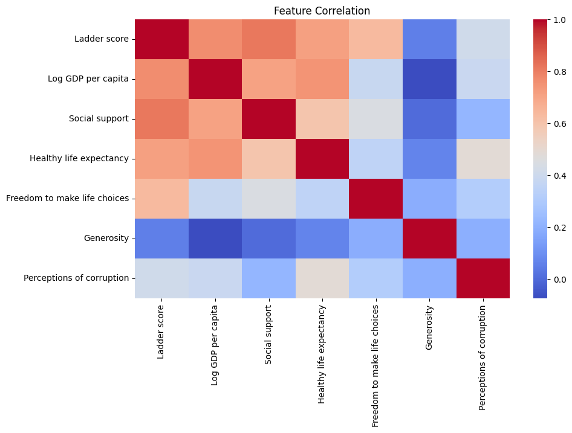
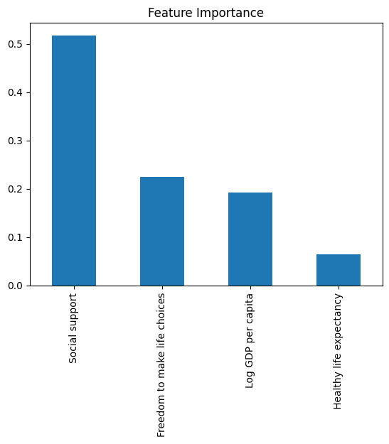

# Happiness Score Prediction using Machine Learning

This project uses the **World Happiness Report 2025** dataset to predict a country's happiness (Ladder) score using a Random Forest regression model. I built this as a way to explore how socioeconomic factors like GDP, social support, and freedom relate to how happy people report feeling across different countries.

---

## What the Project Does

The notebook walks through the full pipeline — loading and exploring the data, visualizing feature correlations, training a machine learning model, evaluating it, and then analyzing which features matter most.

---

## Dataset

- **Source:** World Happiness Report 2025 (`WHR_2025.csv`)
- **Target variable:** `Ladder score` (the happiness score)
- **Features used:**
  - Log GDP per capita
  - Social support
  - Healthy life expectancy
  - Freedom to make life choices

---

## Project Walkthrough

### 1. Import Libraries
Standard imports — `pandas`, `matplotlib`, `seaborn`, and `scikit-learn`.

### 2. Load Dataset
Loaded the CSV and previewed the first few rows to understand the structure.

### 3. Correlation Heatmap
Before jumping into modeling, I plotted a heatmap to see how the features relate to each other and to the target variable.



### 4. Train/Test Split
Selected the four most relevant features, handled missing values by filling with column means, and split the data 80/20 for training and testing.

### 5. Train the Model
Used a `RandomForestRegressor` with 200 trees. Random Forest works well here because it handles non-linear relationships between features and is relatively robust to outliers.

### 6. Evaluate — RMSE
Evaluated the model using Root Mean Squared Error (RMSE). Lower is better — it tells us on average how far off our predictions are from the actual happiness scores.

> **RMSE:** 0.5449509637442936

### 7. Error Analysis
Looked at which countries had the highest prediction error — useful for understanding where the model struggles.

### 8. Feature Importance
Plotted the feature importances from the trained Random Forest to see which factors the model relied on most.



---

## Results Summary

| Metric | Value |
|--------|-------|
| Model | Random Forest Regressor |
| Number of estimators | 200 |
| Test size | 20% |
| RMSE | 0.5449509637442936 |

---

## How to Run

1. Clone the repo or download the notebook
2. Make sure you have the dataset (`WHR_2025.csv`) in the **data** directory
3. Install dependencies:
   ```
   pip install pandas matplotlib seaborn scikit-learn
   ```
4. Open [](https://colab.research.google.com/github/ahshah322/Happiness-Score-Machine-Learning-Prediction/blob/main/notebooks/Happiness-Score-Machine-Learning-Prediction.ipynb) and run from top to bottom

---

## Libraries Used

- `pandas` — data loading and manipulation
- `matplotlib` / `seaborn` — visualization
- `scikit-learn` — model training and evaluation
- `numpy` — numerical operations

---

## Reflection

Looking at the feature importance chart, social support turned out to be the strongest predictor at around 0.52, which surprised me since I expected GDP per capita to dominate. It actually came in third at 0.19, behind freedom to make life choices at 0.22. Healthy life expectancy had the least influence at only 0.07 despite showing a clear correlation in the heatmap, likely because it overlaps too much with GDP to add much on its own.

The heatmap also helped me decide to leave out generosity and perceptions of corruption since both showed weak correlations with the ladder score and would have added noise more than value.
